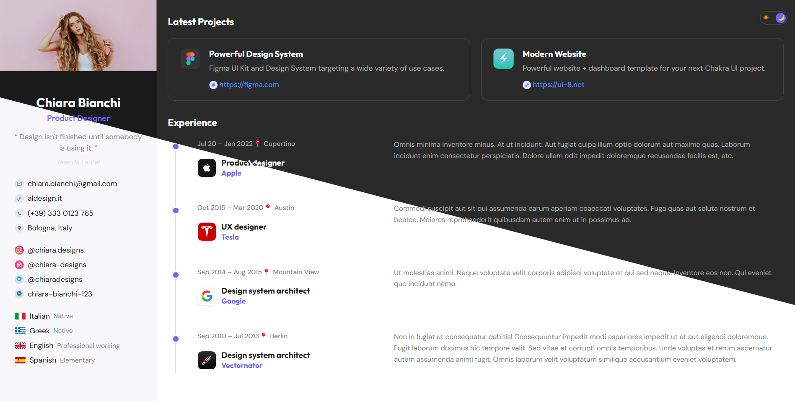

# LSPP Figma Portfolio

---

## Project Overview

This project is an HTML/CSS assignment focused on converting a given Figma design into a high-quality web page. The primary goal is to create a responsive, accessible, and maintainable front-end solution using modern web development practices.


---

## Functional Requirements

* **Responsiveness:** The design must be fully responsive for both mobile and desktop screen sizes, ensuring an optimal viewing experience across various devices.
* **Semantic HTML:** All HTML elements should be used semantically to convey meaning and structure, improving accessibility and SEO.
* **BEM Naming Convention:** The Block Element Modifier (BEM) methodology must be applied consistently for all CSS class names to ensure maintainability and scalability.
* **SCSS Usage:** The project utilizes SCSS (Sass) for styling, leveraging its features like variables, nesting, and partials for organized and efficient CSS.
* **File Structure:** The project adheres to the following file structure:

    ```
    ...
    ├── index.html
    ├── css/
    │   ├── main.css
    │   └── main.css.map
    ├── assets/
    │   └── ...png
    └── scss/
        └── main.scss
    ```

    The `assets` folder is designated for storing all project images.

---

## Non-functional Requirements

* **SCSS Mixins for BEM:** Implementation of SCSS mixins to generate BEM-style classes programmatically, enhancing code reusability and reducing verbosity.
* **Generic Class Names:** Prioritize the use of generic and reusable class names where appropriate to promote modularity and reduce redundancy.
* **Accessibility Enhancements:** Integration of `aria-label`, `aria-*`, `role`, and `alt` attributes as needed to significantly improve the web page's accessibility for users with disabilities.

---

## Usage Guide

To view and interact with this project locally, follow these simple steps:

1.  **Clone the Repository:**
    ```bash
    git clone https://github.com/curtainteddy/LSPP-Figma-Port.git
    cd LSPP-Figma-Port
    ```
2.  **Install SCSS Compiler (if not already installed globally):**
    If you don't have Sass installed, you can do so via npm:
    ```bash
    npm install -g sass
    ```
3.  **Compile SCSS:**
    Navigate to the root of your project and compile your SCSS to CSS. You might set up a watch command for development:
    ```bash
    sass --watch scss:css
    ```
    (Ensure you have a `css` folder at the root, or adjust the output path.)
4.  **Open `index.html`:**
    Simply open the `index.html` file in your preferred web browser. All styles will be applied automatically, given the SCSS has been compiled.

---

## Deployment

Live Demo: [Github Pages](https://curtainteddy.github.io/LSPP-Figma-Port/)

---